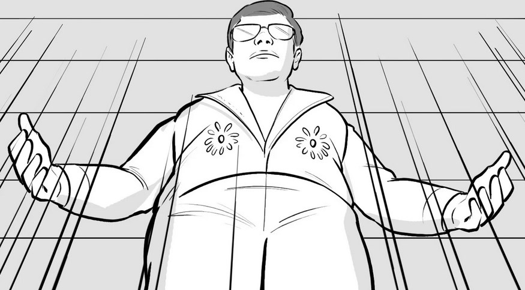
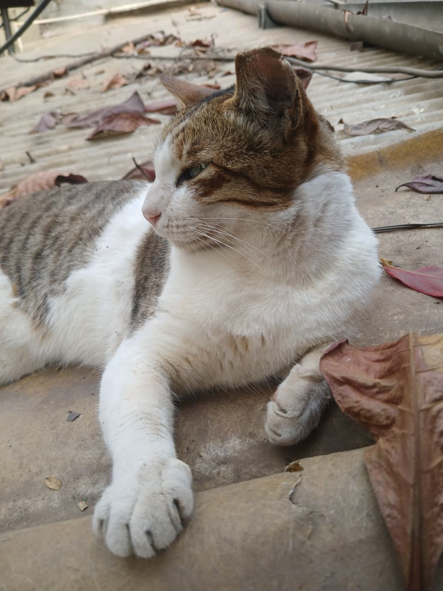
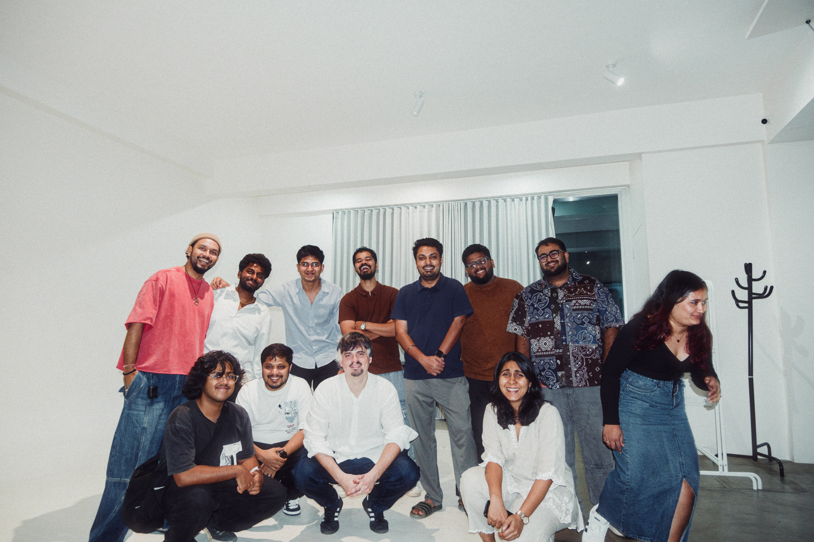
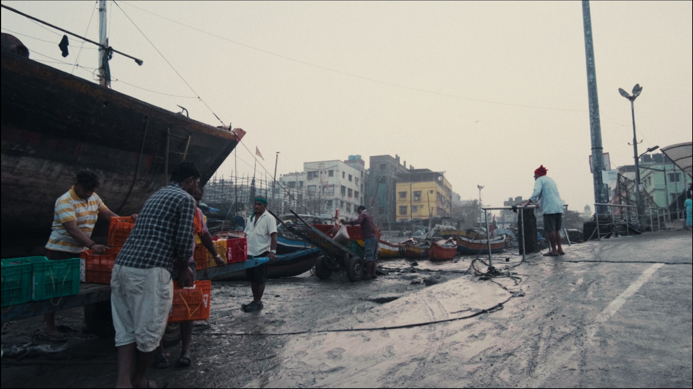

# 30th Jan 2026, Friday
### 30.01.26

Music I'm listening to today, I found [Monochrome](https://monochrome.samidy.com). 

Ofcourse my listening should be on lastfm and listenbrainz, but I just felt like mentioning it here, along with the links of it and all.

Very much liking [Oldies Lover｜70s Soul & R&B Vinyl Set](https://www.youtube.com/watch?v=g9qOEYYCFvM&list=RDg9qOEYYCFvM&start_radio=1)

Kedhhar told us to gather some case studies, picking some from: [This Medium Article](https://johnkovacevich.medium.com/case-studies-for-the-2025-cannes-lions-grand-prix-winners-2b305a5ddd65)\
\
Specifically:\
[Lucky Yatra Ticket](https://www.youtube.com/watch?v=19fzAvuFq0I)\
[Caption with Intent](https://www.youtube.com/watch?v=19fzAvuFq0I)\
[Penny Price Packs - Packaging Project](https://www.youtube.com/watch?v=wXx6z3mDnVc)\
[Paris 2024 Olympics Opening](https://www.youtube.com/watch?v=QhzcYYDzbnQ)\
[Kitkat vs Phones Campaign](https://lbbonline.com/news/kitkat-call-for-a-collective-phone-break)\
[L'Oreal Paris - The Final Copy of Ilon Specht case study](https://www.youtube.com/watch?v=-4o8bCc6-GM)\
[Considering What? | Paris 2024 Paralympic Games](https://www.youtube.com/watch?v=bUs_mNTNwvE)\
[https://www.youtube.com/watch?v=19fzAvuFq0I](https://www.youtube.com/watch?v=19fzAvuFq0I)\

# 31st Jan 2026, Saturday
### 31.01.26

Hi goodmorning, I'm kind of tired of the real *paper*  journal. So I spent some time creating this "journal" alias and then fixing some issues with nvim. Turns out there were no real issues, I just figured out today finally how to automatically attach an LSP server to a file type 

> [!TIP] You just add the server name in the lspconfig. It was that fucking simple I'm gonna kill myself.

### 12:28 PM
It's **12:28** right now and I still haven't gotten any real work done for footloose. I need to catch up to the WhatsApp chats.

Atharv still isn't here, I guess he's working from home. They have a call with the agency going on right now. But I don't need to join it. Huh. I guess I don't have any real work to do right now.

### 1:45 PM Call with Ishan:
- Shots of dust on the table, line created by the dust 
- Going a little back to show sincere cleaning as well, references for that 
- References of Mopping and Chopping with band 
- Really ugly ass table or kitchen sink 
- Chalani Reference

I am possibly getting a little bored / tired of this. I would prefer to be outside. ugh. I guess I can just do namak work nvm.

Atharv just left at 5:30, he's gonna attend that call from home. I'm also like done so I'm leaving in 5 minutes as well. It's 5:45 rn.

# 2nd Feb 2026, Monday
### 02.02.26
### 11:37 AM
Goodmorning dear. Sunday was very nice, I didn't do any work because jeez it's sunday. There was a recce that I couldn't attend because I had to shift, also because I didn't have enough sleep. I thought I could go and attend it but the moment my head hit the bed I was sleeping before I even knew it.

> Around this time Kedhhar also told Ishan he wanted to talk to Indrashish and make some changes, lowk felt like he was scolding the team or sm. Saying the storyboard and rest was too ambitious

Anyways, at the office I walked in to see a blue bag on the outside table and wires on the inside table. Looks like the electricity was gone. I wanted to shoot because when else would I get the opportunity to do that, I met a cat and I pet the cat mau.

Ishan had called me before I left for an edit I needed to put together in premiere (or it could be any NLE). But when I asked him for the footage he said he was going to do it himself, sure why not.

I'm back to looking for very specific, lowkey useless references for the dumb ass client. One was for one singer sliding on the floor and another was for the Uncle giving shabaashi to the husband. 

 

I need to make a list of things I need to do.

- [ ] Work on Namak, make the film
- [ ] Edit Karan and Nanku footage
- [ ] Edit the photos from the Goa trip
- [ ] Update the website
- [ ] Redo edit for Lost Life (refer to expectations vs reality)
- [ ] Join a film club in Mumbai / Find places to go to in Mumbai
- [x] Buy tickets for PCRC

### PPM Meeting Notes
### 04:22 PM

Indrashish is explaining the UC Storyboard.
End of the storyboard part, he sent them the 60s storyboard link.
[UC Animatics 60](https://youtu.be/5B4n4RN-ERU) 

> **UC replying:** The TG feels too young. Where two young individuals are too lazy to open up, but the target audience is supposed to be more audience. They should not just be lazy but rather they don't have enough time to clean up. Get the positioning from the TG POV not be that young, overall they're unorganized individual. But rather it should be two individuals in a stressfull situation. 

> **IM Reply**: I think it takes care of the fact that this is not that TG that you're talking about. Lets not monopolize parties to only younger people. A lot of people on the call included the hall doesn't look pretty after a party. But the art of the house and the furniture immediately makes it evident that they're older than 25.

> The fact that they're very hard press of time won't be able to be expressed in this context.

> You needed the party to happen to exaggerate that there was that much mess. We don't actually need to see the party. But having the party there eleveates the mess. The visuals should not seem tame compared to the wild song.

> **UC:** Maybe instead of them lying on the bed they're just lounging in the house. Overall it could look like an adult party.

> **IM** What can we do to make it look unskippable from the start? Which is why the scene of them lying on the couch. They're just vegitating and watching TV.

> **UC** The house needs to be justifiably messy.. (sure buddy), rather than decadent. What could happen to everyday people rather than a lazy couple after a party.

After this they took like a 5 minute tea break. Came back talked a little and then settled on everything.

While they did that I tried to figure out how to convert markdown to html and `pandoc` came to the rescue, a pretty cool software imo. 

### 2026-02-02 19:05 
Yeah I'm just going to go home refresh have the dinner and then meet kanishka.

### 10:53
Hi so I didn't meet Kanishka, she wanted to reschedule because of an office thing again. I went and met 💙*Mouse* because I love mouse :)

I'm thinking of lists that I need to make, again just things I need to do

- [ ] Make a list of monthly budget
- [ ] List of things I need back from Pune
- [X] Write that reddit post, I'll do it now only
- [ ] List of things I need to buy as soon as possible

# 3rd Feb 2026, Tuesday

I woke up late because I slept at 2:30, woke up at 10:15-20 I'm not really sure. I had poha and reached the office kind of late (Around 11:30) but it's okay. I met the little cat 🐱 again =meow=

I'm now putting up photos on the Featured Casting Deck on Canva 🎨
\
[Featured Cast Deck](https://www.canva.com/design/DAHAPRM7_1U/pT6HXHG0QcFS5xpVIlXl4w)\
\
I also put up the art references up in that Deck \
[UC Art References](https://www.canva.com/design/DAHAPnqS7Wo/UjijTGEz2OMFoLrweSSxnA/edit?ui=e30)

Lowk kinda of fun but my brain is literally turned off and my ass hurts because I'm sitting on the wooden bench.

### 01:14 PM

I just shifted to the other good chair and OH MY GOD, why the fuck do they even have that stupid ass wooden bench my ass was hurting so much. God damn dumbass wooden bench. This is genuinely so much better 😭😭😭.

### 02:43 PM

So apparently today is prep day?!! crazy. we're doing some kind of recce / prep at the studio itself. 

These dances r damn funny. The featured cast person keeps sending more photos and videos it's so damn unorganised lowk

### 03:32 AM (technically 4th Feb)

Me and Mouse 🐭 went and met Yashi 🍏! She was extremely sweet and I had so much fun yayyy! :) 
I talked to Rudra 🚗 for like 2 fucking hours oh my god, I promised him that we wouldn't talk to much 😭😭😭. I think I lied to him or sm. **SORRY RUDRA** [^mn] 

[^mn]:
    {-} I love rudra

 

Yeah I really need to go to sleep dawg

# 4th Feb 2026, Wednesday

### 02:29 PM
There was so much work since the morning ☀, that I'm finally writing right now at 2 PM. Started with putting up a bunch of cast up on the 
[Featured Cast Deck](https://www.canva.com/design/DAHAPRM7_1U/pT6HXHG0QcFS5xpVIlXl4w). They're still sending more and more.

I also got to work making the welcome screen in 🟪After Effects `Internship/UC Welcome Screen`. I'm kinda having fun, need to add a few more elements some SVG's.

### 04:54 PM

I just woke up from sleep what the fuck I slept in the office

 

### 07:42PM

I'm going to Zhenwei Film Lab [zhenweifilmlab@gmail.com](zhenweifilmlab@gmail.com) For a talk with Sam Alexander Gregg, but mostly I'm just excited to meet other photographers in Mumbai yknow.

 

## Urban Clap Shoot Message

**SHOOT CALL TIME**
 
**Production House : Footloose Films LLP**
**Project : Urban Company**
**Shoot Date : 05.02.2026**

Director : Indrasish Mukerjee\
Executive Producer : Kedhhar Barrve\
Producer : Pallavi Singh\
DOP : Shivendu Kudalkar\
Production Designer : Rohini Sen

**Pre Call Time for Production & Light**\
**Call Time : 06:00AM**\
**Shift Time : 07:00AM**

**Shoot Call Time**\
Call Time : 08:00AM\
Shift Time : 09:00AM

**Location Details**\
Location Address  : Marigold Bungalow, Suchak Society, Opp. Malad West, Raheja Exotica, Pascal Wadi, Madh, Mumbai, Maharashtra 400061
Location Pin : [https://maps.app.goo.gl/bETXg9TLELkMGpPp9?g_st=ic](https://maps.app.goo.gl/bETXg9TLELkMGpPp9?g_st=ic)

Contact Details:\
Vikas Mandal : +919004288322\
Laxman Sharma : +9198702 92911

**Please carry the hard copy of the invoice, billing details as below**

**Ensure the following details are included in the invoice:**\

- In case if any of the below mentioned details are missing, we would need a revised invoice to initiate the payment process

- Delay in sending invoices would lead to a longer payment clearance process. To avoid these instances, please refer to the pointers mentioned below and share a consolidate invoice document with us on the mentioned timeline to have a streamlined process

**Billing Details: -**

Company Name - FOOTLOOSE FILMS LLP\
Address – Bungalows No 75, 1st Floor,\ 
Aram Nagar Part 2, Off Yari Road,\
Andheri West, Mumbai,\
Maharashtra, 400061\
GST No – 27AAFFF9068G1Z4\
PAN No - AAFFF9068G\
Contact No-7208167598\
Email- [finance@footloosefilms.in](finance@footloosefilms.in)\
[geeta@footloosefilms.in](geeta@footloosefilms.in)\

1. "TAX INVOICE NO" for Taxable Services or Invoice no (if no GST)
2. Name, Address, and Full Bank details (A/c Name, A/c Number, Bank Name & Branch, IFSC Code , Type of account)
3. GST Number (if applicable)
4. PAN Number
5. Date of Invoice and Invoice No.
6. GST Number & PAN No. of Recipient (Footloose Films LLP)
7. Place of supply & State Code – Where services were provided
8. HSN / SAC Code (if applicable)
9. Description of Goods/Services - Project’s Name and Activity details 
10. GST Rate - CGST, SGST, and IGST
11. PDF copy of Invoices with Signature, Stamp, or digital signature/Hard Copies of Invoices with Sign and Stamp
12. Contact no & Email id (Must)

Kindly feel free to contact us if there is any query.

Thank You

# 9th Feb 2026, Monday

Fuckkkk I haven't journaled in like 4 days I don't even know. I guess since the last shoot. Not a lot happened though, the day after the shoot I bunked (lmao) and I watched arcane 😭😭😭 oh my god it's so fucking sad and depressing I love Arcane 💙💜 so much!!!

On saturday not a lot happened, Mouse was very h*rny so I left early but lowk everyone only left early like literally everyone.

On Sunday me and mouse went out and had a lot of fun! we went to kala ghoda art festival, I had pav bhaji. Mousami Barfi & Pav Joshi hehehe.

Today, Monday fuck.

## 08:40 PM

Yes I'm still at the office, I don't know why. Today monday, just worked on subtitling and actually worked a lot in resolve, fixed the hue contrast thing, I think it looks much better now, also definitely breaks much lesser oh my god 😭😭😭. Then made the footloose films circle logo, wow such a huge job

yeah I'm going fucking home, the lunch was ass but I'm just going to give it to mouse I only had the parathas all day I'm kind of starving heh. Okay bye I'm leaving da office thank you.

Yeah and then my dumbass still didn't leave the office and I stayed for another fucking our. I actually met Snehal 🤍 on the way, we talked for a fucking hour oh my god lmao. It was a lot of fun, but because of that I couldn't go to meet Mouse 💔. It's okay. The dinner was, well, it was good but I hadn't had the lunch so I kind of felt bad. Also why the fuck does she make so much sabzi and 2 rotis bro 😭😭😭.

I watched Rick & Morty and slept 💤

# 10th Feb 2026, Tuesday

Yeah so, I woke up late LMAO. I mean I knew that I was going to be late because my alarm ringed at *9:45 AM* but I just kept snoozing it. Also there's  pigeons 🕊 above the damn AC.

**Atharva** informed that he wasn't going to come to the office because he got fever. I messaged him *Take care Man < 3* but he hasn't replied to my message yet.

I walked in Surendra was cleaning all the awards and I was not late but guess who was 🙄(Mudita was fucking late, and she was the one who shouted at me for coming late yesterday for no fucking reason like?!?!). I was playing with office cat hehe, I love the office cat it's so sweet :( . 

Yeah the entire day I mostly just worked on the UC Shoot Documentation film, like recreating the colors from Genesis, with some very interesting and fun results if I say so myself. Yeah that's literally all that I did.

Lunch was okay, dinner was ass. It was chicken kheema and it smelled really bad, I don't know why. I just didn't like it that much. I'm going to go out now dawg fuck this shit. I'm going to go meet Mouse bye bye I wasted too much time on fixing this treesitter bullshit ugh. It didn't even make a god damn difference to anything.

## 02:28 AM

Does anything matter...\
*I am living, I am alive, I am alive, why why why why* \ 
I want to make a gift for Mouse, I'm still confused if I should make a website or if I should make a silly cute poster or sm. I should be sleeping right but, I really don't feel like sleeping. I feel like doing something. I want to do something. *Something*

 

I need to write down everything I need to do, that way I won't forget all that I need to do / want to do. Isn't this the third fucking list tho. Eh \

- [ ] Make valentine's request for Mouse
- [ ] I genuinely cannot think of anything else, what the fuck.

I guess the most important thing to remember, is to not forget that I DO need to do a lot of things. If I have free time I cannot be picking up new projects and shit. I have a lot of fucking work on my hand that I need to do. Update my website and all yknow. Too many things to fit in my fucking brain right now, this shit is so fragile, I literally can't remember shit man. I wish memories could be proof but you can't trust half of them jesus. This fucking sucks.

Goodnight 🌙

# 11th Feb 2026, Wednesday

Goodmorning!! Listening to DtMF first thing in the morning. I'm so sleepy though I should start sleeping at a proper fucking time lowk.

## 12:15 PM
Back to grinding on Resolve.

### 12:58 PM 
The light went away 😭😭 fuck this man, I'm so sleepy. I'm just gonna make the valentine's website thingy.

## 04:57 PM
So yeah I've only been working on the valentine's invite. This might be better than any valentine's gift 😭😭😭. Which is kinda funny. Also yeah no actual work at the office. Today I'll just send them the photos from the shoot on the group or sm. Maybe that'll make it look like I did do work. Something of that sort yknow?

I should lowk just ask for work but I don't really feel like it?

## 06:54 PM
Omg YAYYY!! I made the valentine's thing yipppeee :).

yeah I'm leaving right now. Fun day. Didn't take any photos :O I should start again or I'll be running out 😭😭

# 12th Feb 2026, Thursday 

I didn't journal for this day so I'm writing on 15th Feb what I did this day. I'm pretty sure I did lowk nothing on 12th. I cooked maggi and it was really bad because I had it with some green Lays chips and it was just really soggy ass chips with some overcooked maggi.

I mostly worked on the documentation video.

# 13th Feb 2026, Friday 

Yeah I mean again I didn't really do anything. Just worked on the documentation video which I finally completed and exported. I need to show it to the seniors for some changes.   

# 14th Feb 2026, Saturday

Valentine's Day ❤ ❤ ❤ It was fun yipppeee

We watched in the mood for love (sad fucking film) and then we went out in the night to Versova to have street food. 

# 16th Feb 2026, Monday

## 01:56 PM

I came in at around 1:30 PM, and yeah I got enough sleep I guess. I mostly spent my morning doing nothing. I had to throw away that awful old ass chana that was in my tiffin. It had the worst smell ever, I couldn't get it out of my head for a while.

The Rapido driver took way too long to show up, I knew that I was going to be late. I thought about taking another rapido to the office instead of walking. But I just felt like I, didn't have to. I don't get paid enough for this. I don't even do work when I'm at the office. It's been 20 minutes or so and I still haven't really done anything yknow. Doesn't make sense that I would even have to anyways because there is just no actual work for me. So I'm just going to work on Namak today I guess. 

Surendra came to ask if I wanted lunch so I'm just going to have lunch now. 

## 04:24 PM

There is no work today AAAAAAAAAAAAAAA. I know I do have work that I need to do. But yeah I just, I don't even know what to do atp.

The Whole Truth Case study 

- bts 
- campaign success
- words from director
- words for agency
- response from audience/ celebs
- motion graphics
- song history (its connection to Indian audience)
- research and pre production
- packaging for competitor brand
- use of color & sound effects

Found a few references for the case study me and Atharva are going to work one

## 07:38 PM

Now I'm just going to go home, I already stayed for way too long today again! brah. I don't even know why. Stupid stupid stupid.

# 17th Feb 2026, Tuesday

I actually didn't write in the journal this day. But I did actually get work (finally).

Atharva and me are working on the case study film for **The Whole Truth**, so we both just started working on that. I installed copyparty on the office iMac because why not, it makes it a lot easier to access data on my laptop rather than using the shitty iMac which is stable but it doesn't have enough GPU power. I really think they should've invested in a desktop PC instead, like most normal places like why the fuck would you buy an intel iMac?! whatever.

I got copyparty up and running, then I started working on the motion graphics for the case study film. I'm keeping it kinda simple and fun with a collag-y and rough style like *Vox*. That's definitely going to be fun.

Atharva wrote the script so I just got till the part where we needed it to be, then I went home.

Dnyanu wanted me to come with her to the doctor because she wasn't feeling well. So the both of us went to this Government hospital in Adheri west, very close to Amar pav bhaji. It was a very huge hospital and we genuinely got lost in the hospital. We were told to wait for half an hour so I started reading "**Bell Jar**" In the waiting room. I think I'm falling in love with the way Sylvia Plath writes. It's sultry, yearning and depressive nature really appeals to me.

We didn't have any cash, so I had to ask people if they would exchange cash with me so I could digitally reimburse them. When I asked these two fellows outside the hospital, they started ruffling around in their pockets. I glimpsed a 500 rupee note as it vanished back, right when the orange man gave me 10 rupees of crumpled money. I asked them for their UPI ID's but they wouldn't budge, I just had to let them be kind to me.

# 18th Feb 2026, Wednesday

## 12:01 PM
I think I feel tired. I felt tired as I climbed up a mountain of stairs juggling my camera as the sun pierced my eyes. I caught 6 hours of sleep in the night, reason for why I look ugly today. But it's because I didn't shave, and I never shave often, so I often feel ugly. I set up to record myself in the camera but I looked at myself and thought *maybe I'll do this tomorrow, after I look better and the cat is here* 

Maybe I would do it tomorrow, idk how I feel about anything really.

Atharva isn't here today, he's sick and I want to wish him well. I don't really have much work to do. I'm just going to reimagine my film "Lost Life", turn it into reality the way I concieved it.
