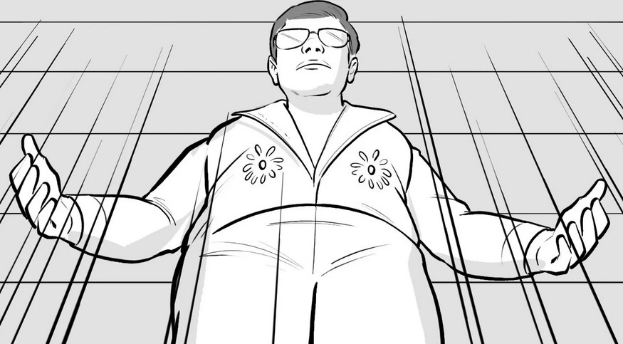
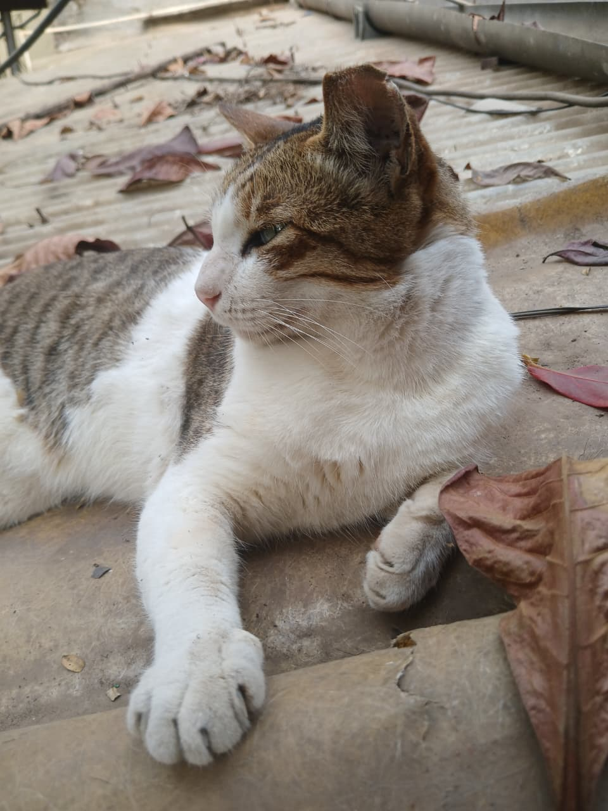
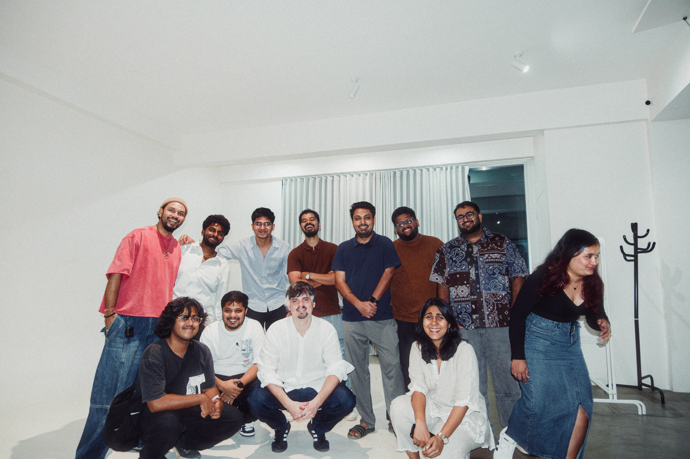
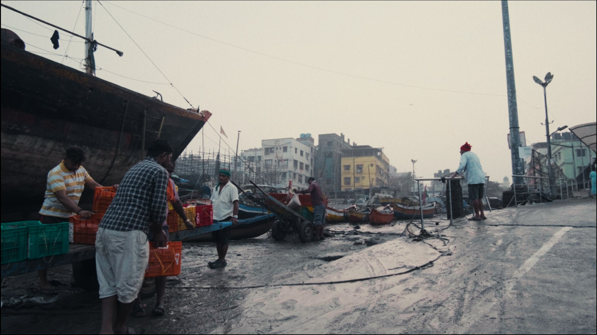

# 30th Jan 2026, Friday
### 30.01.26

Music I'm listening to today, I found [Monochrome](https://monochrome.samidy.com). 

Ofcourse my listening should be on lastfm and listenbrainz, but I just felt like mentioning it here, along with the links of it and all.

Very much liking [Oldies Lover｜70s Soul & R&B Vinyl Set](https://www.youtube.com/watch?v=g9qOEYYCFvM&list=RDg9qOEYYCFvM&start_radio=1)

Kedhhar told us to gather some case studies, picking some from: [This Medium Article](https://johnkovacevich.medium.com/case-studies-for-the-2025-cannes-lions-grand-prix-winners-2b305a5ddd65)\
\
Specifically:\
[Lucky Yatra Ticket](https://www.youtube.com/watch?v=19fzAvuFq0I)\
[Caption with Intent](https://www.youtube.com/watch?v=19fzAvuFq0I)\
[Penny Price Packs - Packaging Project](https://www.youtube.com/watch?v=wXx6z3mDnVc)\
[Paris 2024 Olympics Opening](https://www.youtube.com/watch?v=QhzcYYDzbnQ)\
[Kitkat vs Phones Campaign](https://lbbonline.com/news/kitkat-call-for-a-collective-phone-break)\
[L'Oreal Paris - The Final Copy of Ilon Specht case study](https://www.youtube.com/watch?v=-4o8bCc6-GM)\
[Considering What? | Paris 2024 Paralympic Games](https://www.youtube.com/watch?v=bUs_mNTNwvE)\
[https://www.youtube.com/watch?v=19fzAvuFq0I](https://www.youtube.com/watch?v=19fzAvuFq0I)\

# 31st Jan 2026, Saturday
### 31.01.26

Hi goodmorning, I'm kind of tired of the real *paper*  journal. So I spent some time creating this "journal" alias and then fixing some issues with nvim. Turns out there were no real issues, I just figured out today finally how to automatically attach an LSP server to a file type 

> [!TIP] You just add the server name in the lspconfig. It was that fucking simple I'm gonna kill myself.

### 12:28 PM
It's **12:28** right now and I still haven't gotten any real work done for footloose. I need to catch up to the WhatsApp chats.

Atharv still isn't here, I guess he's working from home. They have a call with the agency going on right now. But I don't need to join it. Huh. I guess I don't have any real work to do right now.

### 1:45 PM Call with Ishan:
- Shots of dust on the table, line created by the dust 
- Going a little back to show sincere cleaning as well, references for that 
- References of Mopping and Chopping with band 
- Really ugly ass table or kitchen sink 
- Chalani Reference

I am possibly getting a little bored / tired of this. I would prefer to be outside. ugh. I guess I can just do namak work nvm.

Atharv just left at 5:30, he's gonna attend that call from home. I'm also like done so I'm leaving in 5 minutes as well. It's 5:45 rn.

# 2nd Feb 2026, Monday
### 02.02.26
### 11:37 AM
Goodmorning dear. Sunday was very nice, I didn't do any work because jeez it's sunday. There was a recce that I couldn't attend because I had to shift, also because I didn't have enough sleep. I thought I could go and attend it but the moment my head hit the bed I was sleeping before I even knew it.

> Around this time Kedhhar also told Ishan he wanted to talk to Indrashish and make some changes, lowk felt like he was scolding the team or sm. Saying the storyboard and rest was too ambitious

Anyways, at the office I walked in to see a blue bag on the outside table and wires on the inside table. Looks like the electricity was gone. I wanted to shoot because when else would I get the opportunity to do that, I met a cat and I pet the cat mau.

Ishan had called me before I left for an edit I needed to put together in premiere (or it could be any NLE). But when I asked him for the footage he said he was going to do it himself, sure why not.

I'm back to looking for very specific, lowkey useless references for the dumb ass client. One was for one singer sliding on the floor and another was for the Uncle giving shabaashi to the husband. 

 

I need to make a list of things I need to do.

- [ ] Work on Namak, make the film
- [ ] Edit Karan and Nanku footage
- [ ] Edit the photos from the Goa trip
- [ ] Update the website
- [ ] Redo edit for Lost Life (refer to expectations vs reality)
- [ ] Join a film club in Mumbai / Find places to go to in Mumbai
- [x] Buy tickets for PCRC

### PPM Meeting Notes
### 04:22 PM

Indrashish is explaining the UC Storyboard.
End of the storyboard part, he sent them the 60s storyboard link.
[UC Animatics 60](https://youtu.be/5B4n4RN-ERU) 

> **UC replying:** The TG feels too young. Where two young individuals are too lazy to open up, but the target audience is supposed to be more audience. They should not just be lazy but rather they don't have enough time to clean up. Get the positioning from the TG POV not be that young, overall they're unorganized individual. But rather it should be two individuals in a stressfull situation. 

> **IM Reply**: I think it takes care of the fact that this is not that TG that you're talking about. Lets not monopolize parties to only younger people. A lot of people on the call included the hall doesn't look pretty after a party. But the art of the house and the furniture immediately makes it evident that they're older than 25.

> The fact that they're very hard press of time won't be able to be expressed in this context.

> You needed the party to happen to exaggerate that there was that much mess. We don't actually need to see the party. But having the party there eleveates the mess. The visuals should not seem tame compared to the wild song.

> **UC:** Maybe instead of them lying on the bed they're just lounging in the house. Overall it could look like an adult party.

> **IM** What can we do to make it look unskippable from the start? Which is why the scene of them lying on the couch. They're just vegitating and watching TV.

> **UC** The house needs to be justifiably messy.. (sure buddy), rather than decadent. What could happen to everyday people rather than a lazy couple after a party.

After this they took like a 5 minute tea break. Came back talked a little and then settled on everything.

While they did that I tried to figure out how to convert markdown to html and `pandoc` came to the rescue, a pretty cool software imo. 

### 2026-02-02 19:05 
Yeah I'm just going to go home refresh have the dinner and then meet kanishka.

### 10:53
Hi so I didn't meet Kanishka, she wanted to reschedule because of an office thing again. I went and met 💙*Mouse* because I love mouse :)

I'm thinking of lists that I need to make, again just things I need to do

- [ ] Make a list of monthly budget
- [ ] List of things I need back from Pune
- [X] Write that reddit post, I'll do it now only
- [ ] List of things I need to buy as soon as possible

# 3rd Feb 2026, Tuesday

I woke up late because I slept at 2:30, woke up at 10:15-20 I'm not really sure. I had poha and reached the office kind of late (Around 11:30) but it's okay. I met the little cat 🐱 again =meow=

I'm now putting up photos on the Featured Casting Deck on Canva 🎨
\
[Featured Cast Deck](https://www.canva.com/design/DAHAPRM7_1U/pT6HXHG0QcFS5xpVIlXl4w)\
\
I also put up the art references up in that Deck \
[UC Art References](https://www.canva.com/design/DAHAPnqS7Wo/UjijTGEz2OMFoLrweSSxnA/edit?ui=e30)

Lowk kinda of fun but my brain is literally turned off and my ass hurts because I'm sitting on the wooden bench.

### 01:14 PM

I just shifted to the other good chair and OH MY GOD, why the fuck do they even have that stupid ass wooden bench my ass was hurting so much. God damn dumbass wooden bench. This is genuinely so much better 😭😭😭.

### 02:43 PM

So apparently today is prep day?!! crazy. we're doing some kind of recce / prep at the studio itself. 

These dances r damn funny. The featured cast person keeps sending more photos and videos it's so damn unorganised lowk

### 03:32 AM (technically 4th Feb)

Me and Mouse 🐭 went and met Yashi 🍏! She was extremely sweet and I had so much fun yayyy! :) 
I talked to Rudra 🚗 for like 2 fucking hours oh my god, I promised him that we wouldn't talk to much 😭😭😭. I think I lied to him or sm. **SORRY RUDRA** [^mn] 

[^mn]:
    {-} I love rudra

 

Yeah I really need to go to sleep dawg

# 4th Feb 2026, Wednesday

### 02:29 PM
There was so much work since the morning ☀, that I'm finally writing right now at 2 PM. Started with putting up a bunch of cast up on the 
[Featured Cast Deck](https://www.canva.com/design/DAHAPRM7_1U/pT6HXHG0QcFS5xpVIlXl4w). They're still sending more and more.

I also got to work making the welcome screen in 🟪After Effects `Internship/UC Welcome Screen`. I'm kinda having fun, need to add a few more elements some SVG's.

### 04:54 PM

I just woke up from sleep what the fuck I slept in the office

 

### 07:42PM

I'm going to Zhenwei Film Lab [zhenweifilmlab@gmail.com](zhenweifilmlab@gmail.com) For a talk with Sam Alexander Gregg, but mostly I'm just excited to meet other photographers in Mumbai yknow.

 

## Urban Clap Shoot Message

**SHOOT CALL TIME**
 
**Production House : Footloose Films LLP**
**Project : Urban Company**
**Shoot Date : 05.02.2026**

Director : Indrasish Mukerjee\
Executive Producer : Kedhhar Barrve\
Producer : Pallavi Singh\
DOP : Shivendu Kudalkar\
Production Designer : Rohini Sen

**Pre Call Time for Production & Light**\
**Call Time : 06:00AM**\
**Shift Time : 07:00AM**

**Shoot Call Time**\
Call Time : 08:00AM\
Shift Time : 09:00AM

**Location Details**\
Location Address  : Marigold Bungalow, Suchak Society, Opp. Malad West, Raheja Exotica, Pascal Wadi, Madh, Mumbai, Maharashtra 400061
Location Pin : [https://maps.app.goo.gl/bETXg9TLELkMGpPp9?g_st=ic](https://maps.app.goo.gl/bETXg9TLELkMGpPp9?g_st=ic)

Contact Details:\
Vikas Mandal : +919004288322\
Laxman Sharma : +9198702 92911

**Please carry the hard copy of the invoice, billing details as below**

**Ensure the following details are included in the invoice:**\

- In case if any of the below mentioned details are missing, we would need a revised invoice to initiate the payment process

- Delay in sending invoices would lead to a longer payment clearance process. To avoid these instances, please refer to the pointers mentioned below and share a consolidate invoice document with us on the mentioned timeline to have a streamlined process

**Billing Details: -**

Company Name - FOOTLOOSE FILMS LLP\
Address – Bungalows No 75, 1st Floor,\ 
Aram Nagar Part 2, Off Yari Road,\
Andheri West, Mumbai,\
Maharashtra, 400061\
GST No – 27AAFFF9068G1Z4\
PAN No - AAFFF9068G\
Contact No-7208167598\
Email- [finance@footloosefilms.in](finance@footloosefilms.in)\
[geeta@footloosefilms.in](geeta@footloosefilms.in)\

1. "TAX INVOICE NO" for Taxable Services or Invoice no (if no GST)
2. Name, Address, and Full Bank details (A/c Name, A/c Number, Bank Name & Branch, IFSC Code , Type of account)
3. GST Number (if applicable)
4. PAN Number
5. Date of Invoice and Invoice No.
6. GST Number & PAN No. of Recipient (Footloose Films LLP)
7. Place of supply & State Code – Where services were provided
8. HSN / SAC Code (if applicable)
9. Description of Goods/Services - Project’s Name and Activity details 
10. GST Rate - CGST, SGST, and IGST
11. PDF copy of Invoices with Signature, Stamp, or digital signature/Hard Copies of Invoices with Sign and Stamp
12. Contact no & Email id (Must)

Kindly feel free to contact us if there is any query.

Thank You

# 9th Feb 2026, Monday

Fuckkkk I haven't journaled in like 4 days I don't even know. I guess since the last shoot. Not a lot happened though, the day after the shoot I bunked (lmao) and I watched arcane 😭😭😭 oh my god it's so fucking sad and depressing I love Arcane 💙💜 so much!!!

On saturday not a lot happened, Mouse was wanted to really see me :p so I left early but lowk everyone only left early like literally everyone.

On Sunday me and mouse went out and had a lot of fun! we went to kala ghoda art festival, I had pav bhaji. Mousami Barfi & Pav Joshi hehehe.

Today, Monday fuck.

## 08:40 PM

Yes I'm still at the office, I don't know why. Today monday, just worked on subtitling and actually worked a lot in resolve, fixed the hue contrast thing, I think it looks much better now, also definitely breaks much lesser oh my god 😭😭😭. Then made the footloose films circle logo, wow such a huge job

yeah I'm going fucking home, the lunch was ass but I'm just going to give it to mouse I only had the parathas all day I'm kind of starving heh. Okay bye I'm leaving da office thank you.

Yeah and then my dumbass still didn't leave the office and I stayed for another fucking our. I actually met Snehal 🤍 on the way, we talked for a fucking hour oh my god lmao. It was a lot of fun, but because of that I couldn't go to meet Mouse 💔. It's okay. The dinner was, well, it was good but I hadn't had the lunch so I kind of felt bad. Also why the fuck does she make so much sabzi and 2 rotis bro 😭😭😭.

I watched Rick & Morty and slept 💤

# 10th Feb 2026, Tuesday

Yeah so, I woke up late LMAO. I mean I knew that I was going to be late because my alarm ringed at *9:45 AM* but I just kept snoozing it. Also there's  pigeons 🕊 above the damn AC.

**Atharva** informed that he wasn't going to come to the office because he got fever. I messaged him *Take care Man < 3* but he hasn't replied to my message yet.

I walked in Surendra was cleaning all the awards and I was not late but guess who was 🙄(Mudita was fucking late, and she was the one who shouted at me for coming late yesterday for no fucking reason like?!?!). I was playing with office cat hehe, I love the office cat it's so sweet :( . 

Yeah the entire day I mostly just worked on the UC Shoot Documentation film, like recreating the colors from Genesis, with some very interesting and fun results if I say so myself. Yeah that's literally all that I did.

Lunch was okay, dinner was ass. It was chicken kheema and it smelled really bad, I don't know why. I just didn't like it that much. I'm going to go out now dawg fuck this shit. I'm going to go meet Mouse bye bye I wasted too much time on fixing this treesitter bullshit ugh. It didn't even make a god damn difference to anything.

## 02:28 AM

Does anything matter...\
*I am living, I am alive, I am alive, why why why why* \ 
I want to make a gift for Mouse, I'm still confused if I should make a website or if I should make a silly cute poster or sm. I should be sleeping right but, I really don't feel like sleeping. I feel like doing something. I want to do something. *Something*

 

I need to write down everything I need to do, that way I won't forget all that I need to do / want to do. Isn't this the third fucking list tho. Eh \

- [ ] Make valentine's request for Mouse
- [ ] I genuinely cannot think of anything else, what the fuck.

I guess the most important thing to remember, is to not forget that I DO need to do a lot of things. If I have free time I cannot be picking up new projects and shit. I have a lot of fucking work on my hand that I need to do. Update my website and all yknow. Too many things to fit in my fucking brain right now, this shit is so fragile, I literally can't remember shit man. I wish memories could be proof but you can't trust half of them jesus. This fucking sucks.

Goodnight 🌙

# 11th Feb 2026, Wednesday

Goodmorning!! Listening to DtMF first thing in the morning. I'm so sleepy though I should start sleeping at a proper fucking time lowk.

## 12:15 PM
Back to grinding on Resolve.

### 12:58 PM 
The light went away 😭😭 fuck this man, I'm so sleepy. I'm just gonna make the valentine's website thingy.

## 04:57 PM
So yeah I've only been working on the valentine's invite. This might be better than any valentine's gift 😭😭😭. Which is kinda funny. Also yeah no actual work at the office. Today I'll just send them the photos from the shoot on the group or sm. Maybe that'll make it look like I did do work. Something of that sort yknow?

I should lowk just ask for work but I don't really feel like it?

## 06:54 PM
Omg YAYYY!! I made the valentine's thing yipppeee :).

yeah I'm leaving right now. Fun day. Didn't take any photos :O I should start again or I'll be running out 😭😭

# 12th Feb 2026, Thursday 

I didn't journal for this day so I'm writing on 15th Feb what I did this day. I'm pretty sure I did lowk nothing on 12th. I cooked maggi and it was really bad because I had it with some green Lays chips and it was just really soggy ass chips with some overcooked maggi.

I mostly worked on the documentation video.

# 13th Feb 2026, Friday 

Yeah I mean again I didn't really do anything. Just worked on the documentation video which I finally completed and exported. I need to show it to the seniors for some changes.   

# 14th Feb 2026, Saturday

Valentine's Day ❤ ❤ ❤ It was fun yipppeee

We watched in the mood for love (sad fucking film) and then we went out in the night to Versova to have street food. 

# 16th Feb 2026, Monday

## 01:56 PM

I came in at around 1:30 PM, and yeah I got enough sleep I guess. I mostly spent my morning doing nothing. I had to throw away that awful old ass chana that was in my tiffin. It had the worst smell ever, I couldn't get it out of my head for a while.

The Rapido driver took way too long to show up, I knew that I was going to be late. I thought about taking another rapido to the office instead of walking. But I just felt like I, didn't have to. I don't get paid enough for this. I don't even do work when I'm at the office. It's been 20 minutes or so and I still haven't really done anything yknow. Doesn't make sense that I would even have to anyways because there is just no actual work for me. So I'm just going to work on Namak today I guess. 

Surendra came to ask if I wanted lunch so I'm just going to have lunch now. 

## 04:24 PM

There is no work today AAAAAAAAAAAAAAA. I know I do have work that I need to do. But yeah I just, I don't even know what to do atp.

The Whole Truth Case study 

- bts 
- campaign success
- words from director
- words for agency
- response from audience/ celebs
- motion graphics
- song history (its connection to Indian audience)
- research and pre production
- packaging for competitor brand
- use of color & sound effects

Found a few references for the case study me and Atharva are going to work one

## 07:38 PM

Now I'm just going to go home, I already stayed for way too long today again! brah. I don't even know why. Stupid stupid stupid.

# 17th Feb 2026, Tuesday

I actually didn't write in the journal this day. But I did actually get work (finally).

Atharva and me are working on the case study film for **The Whole Truth**, so we both just started working on that. I installed copyparty on the office iMac because why not, it makes it a lot easier to access data on my laptop rather than using the shitty iMac which is stable but it doesn't have enough GPU power. I really think they should've invested in a desktop PC instead, like most normal places like why the fuck would you buy an intel iMac?! whatever.

I got copyparty up and running, then I started working on the motion graphics for the case study film. I'm keeping it kinda simple and fun with a collag-y and rough style like *Vox*. That's definitely going to be fun.

Atharva wrote the script so I just got till the part where we needed it to be, then I went home.

Dnyanu wanted me to come with her to the doctor because she wasn't feeling well. So the both of us went to this Government hospital in Adheri west, very close to Amar pav bhaji. It was a very huge hospital and we genuinely got lost in the hospital. We were told to wait for half an hour so I started reading "**Bell Jar**" In the waiting room. I think I'm falling in love with the way Sylvia Plath writes. It's sultry, yearning and depressive nature really appeals to me.

We didn't have any cash, so I had to ask people if they would exchange cash with me so I could digitally reimburse them. When I asked these two fellows outside the hospital, they started ruffling around in their pockets. I glimpsed a 500 rupee note as it vanished back, right when the orange man gave me 10 rupees of crumpled money. I asked them for their UPI ID's but they wouldn't budge, I just had to let them be kind to me.

# 18th Feb 2026, Wednesday

## 12:01 PM
I think I feel tired. I felt tired as I climbed up a mountain of stairs juggling my camera as the sun pierced my eyes. I caught 6 hours of sleep in the night, reason for why I look ugly today. But it's because I didn't shave, and I never shave often, so I often feel ugly. I set up to record myself in the camera but I looked at myself and thought *maybe I'll do this tomorrow, after I look better and the cat is here* 

Maybe I would do it tomorrow, idk how I feel about anything really.

Atharva isn't here today, he's sick and I want to wish him well. I don't really have much work to do. I'm just going to reimagine my film "Lost Life", turn it into reality the way I concieved it.

I'm so phased that Mudita to write some short captions for the UC Shoot Post. I'm pretty sure they already have a caption ready, but they need it for thanking the Director.

Anyways, here are a few options I'm preparing:
- Thank you so much, @mr.nicecat & @manjabrandworks, this shoot wouldn't exist without your creativity and strategy. This journey has been an "Emotional rollercoaster" `this sucks`

- 'Emotional Atyachaar' was bohot (very?) mazedaar! All thanks to @mr.nicecat & @manjabrandworks for bringing wit & strategy for this shoot. 

- 'Ye directing writing kaun karega' is never a dilemma when we have @mr.nicecat & @manjabrandworks getting the job done!   

- Aapki *bai* aaye ya na aaye @mr.nicecat & @manjabrandworks always show up with meticulous directing & witty writing!

- With @mr.nicecat & @manjabrandworks on the team, making wonderful films is as easy as "Ek, Do, Teen, Chaar, Che! AND CUT"

Mudita appreciated **" 'Ye directing writing kaun karega' is never a dilemma when we have @mr.nicecat & @manjabrandworks getting the job done!"** So I'm just gonna rewrite it perhaps.

It's literally 11:00 PM right now, but I'm just writing this for the rest of the day after lunch. I basically re-edited my LostLife film. I should've transcoded it because now I can't show it to Mouse which is damn stupid of me to do. Yeah that's basically it. I spent around an hour setting up neovim and shit. Which is so fucking stupid man.

# 19th Feb 2026, Thursday

## 05:51 PM

The entire day I basically just worked on my list of things that I need to do. I uploaded `Lost Life` to YouTube

[Lost Life](https://www.youtube.com/watch?v=lSC5JQSpHKo)

Then I edited a bunch of photos from the old Goa & Mumbai trips. There were some really good photos there that I must release.

Found this interesting archive 
<https://lovetheworkmore.com/2024-2/>

Now I have to look for more case study references 

- [ Orange - WoMen's Football](https://www.youtube.com/watch?v=DeijPwBIyK0)
- [CeraVe - Michael CeraVe](https://www.youtube.com/watch?v=6A9zZpEzJi0)
- [Solo Stove - Snoop Goes Smokeless](https://www.youtube.com/watch?v=Vn-cbs8ZPMM)

These are genuinely just so annoying. I don't think I've been so entertained yet so pissed and annoyed at shit like this before.

- [Shah Rukh Khan my-ad](https://www.dandad.org/work/d-ad-awards-archive/shah-rukh-khan-my-ad)
- [#BringBack2011](https://www.dandad.org/work/d-ad-awards-archive/bringback2011)
- [Subconcious Order](https://www.youtube.com/watch?v=HuAQ3UyyjaU)

## 09:33 PM

**Literally hell rained down on me as I tried to figure out what the fuck to do with this dilemma.**

*Once upon a time* (around three years ago) I was in a sweaty, suffocating tent supposed to be sleeping besides two other men. I recall this like the haze it was. One of the men was named "*Hrit*", a tall big guy with a mouth bigger than he was. In the silver of the night he was talking about music, and he asked me "Have you listened to Peter Cat Recording Co. ?". I felt intimidated, haphazardly answering *no*. A minute before my life would change he told me to listen to this track, titled "Clown on The 22nd Dance Floor".

A few lush strings, playfully questioning me before a man started speaking in the microphone. It was an eloquent jazz number with the lyrics stretching me over it's contexts.

"This if from an Indian Band", I was shocked. *What?! they don't make music like this here*. 

After an hour of blur around the fire I was drowsing. When I decided to listen to the entire Album. *Portrait of a Time: 2010-2016* released in 2018. That was a psychedelic experience if I've ever had one.

A jazzy bar, a few lush strings and a piano tip toeing around playfully. 

"We have a shoot on 1st", she smirked. I was back at the dilemma at hand. "Wait, 1st March?" I asked, hoping my ears were broken. "Yes". This is where it started, a shoot on the 1st.

I met Rohan last year. Rohan Johnson was the photographer for Peter Cat Recording Co. He shot their last, big tour and I actually talked to him. TO HIM. I talked with him and I kept up and I finally asked him if I could shoot with him and he said yes. YES. I could shoot for my favorite artist! I would be meeting the band at the jazz bar and I would tell them I love them and all I've done is listen and listen for what felt like forever. The concert was on 1st March.

"I can't come for the shoot", I said. I couldn't, I would never give this up so I could assist for *cleartrip*, some tourism website. They said no like they didn't hear me. They denied me this day like I didn't exist. Like I wasn't saying I couldn't be there.

It didn't matter to me, if I lost this job, or if I would have to start my graduation project again. I wasn't going to give up on shooting for my favorite band.

I left the office. *some fucking drama with work finally*.

> Hi Pallavi, I'm really sorry but I cannot be available on the 1st of March. I've been trying to make this shoot (which is happening on the first) happen for years now and 1st March would be my only chance. 

> I would completely understand if my salary is cut due to this reason (for another AD). If the Cleartrip shoot day is changed or the Concert date is changed I'll definitely be available, and even on any other weekend a shoot happens. This is just a special exception, this won't happen again.

> I'm very committed to footloose and I wouldn't take a leave like this for any other reason. 

> I would also like to know what is the minimum or expected time span before which I need to inform about a leave. When I joined I was told  around a one week notice should be enough.

She replied after an eternity.

> Hi Parth,
I understand this is important for you, especially if you have been trying to make it happen for a while.
At the same time, if something has been planned for months, we really need to be informed about your availability much earlier. For any planned leave, minimum of 15 days notice is required. emergencies are, of course an exception.

> Also, being there for prep but not on the main shoot won't help you understand the shoot process. The shoot day is the most crucial part, especially for a project of this scale.

> I am not dismissing your reason, but we need to be more proactive about communication going forward..

I had thought of what I would do if I lost this job. It didn't have to come to that, but I was prepared. 

I then had my dinner, in peace.

# 20th Feb 2026, Friday

I'm writing this on the next day, but here's what I basically did:

I woke up very late and I informed Geeta ma'am and Atharva that I was going to be late. I slept at 3 AM the previous night, so I needed the sleep either ways. 

I got to the office, started working on the case study motion graphics video. That's pretty much what I did and then during lunch Ishan showed up at the office, and then Indrasish sir showed up as well in an hour.

I went through the script of the cleartrip advertisement pitch, it had the script and a lot of references, I wonder who does all the references if not us. I guess it could be the agency. I recorded some stuff, I put up all the locations up on a google drive link.

Here's the link
Cleartrip Chidiya Ud Locations: <https://drive.google.com/drive/folders/1-aMRzjT-mxNwkESlwnGRUHSUyVbdkKUv?usp=sharing>

I showed Indrasish sir my BTS video, and I also saw the one that the other "19 - 20" made.

# 21st Feb 2026, Saturday

I slept at 5 AM, working on color grading. I did all the hue v hue and hue v sat adjustments in tetra again after using the hue curve which was lowk kinda broken and very bloated. Took me way too long to do this bruh. I also figured that I needed to use the hue v hue curve for fixing the magenta shift from red. Red needed to be shifted towards orange a bit and yellow also needed to be shifted towards orange. So I just put a very very small hue variation curve right around the skin tone indicator so the colors compressed towards it. 

Now Ishan has given me some references to find, back on the grind.

NEED TO LOOK FOR 

Interesting Framing refs - 

Flying refs - 

Landing refs - How are they landing?

Elements of worry going away - Pen paper - Marksheet - Briefcase opens up - 

Silhouettes - Shots that are silhouettes

Mundane life - Frames and ideas

Shots where go pro is required - 

Music reference - Karnatic music style (IM has 2 refs, take from him)

Mudita has again assigned me to come up with a caption 😭😭. Bro what?!

It's for a post for Surya ma'ams "the Honor" award.

- Proud of @suryab for getting recognized at the Khaufnak #theHonours spotlight by @thehollywoodreporter for Khauf

- Our very own @suryab at #theHonours spotlight by @thehollywoodreporter

- We are very *honoured* to see @suryab recognized at #theHonours by @thehollywoodreporter for Khauf

# 22nd Feb 2026, Sunday

Damn I'm writing this on 24th Night, basically 25th morning at 2:25 AM, I really need to catch up. I don't remember what I did on sunday.

I mostly just stayed home, they did call me in the office but I genuinely could not have made it, I was tired and there's no way I'm working 2 consecutive sundays.

I just stayed home and spent time with Mouse

# 23rd Feb 2026, Monday

I came in a little late and I saw that Atharva was actually really tired. He was kind of sleeping with his head down on the table, I think he had a headache.

It was a weird day, both of us didn't really do any work. I think we found a few references for the cleartrip shoot. But both of us, even Surendra we were all tired and sleepy for some reason. Nothing really happened. Don't remember much from the day.

# 24th Feb 2026, Tuesday

I actually had a bunch of work today. The entire AD team came in. Sahil is the first AD. There's Shad, Ishan, Aashna, and two other guys I don't remember their names yet.

I just looked for stock footage all day, I documented some of the day as well. I downloaded the footage, organized it and uploaded it on a google drive link for IM and Ishan to check and sort through. Some of it is definitely too expensive so Mudita has told us to look for cheaper shit.

How the fuck can ya'll not afford stock footage like bro?! You're literally using someone else's hard work, atleast have the decency to pay for it. It's not like you can just use free stock footage for commercial work anyways. There's very less actual "royalty free" stock footage. Commercial licenses usually always cost a little. 

I just discovered that Dhruv Bhola's band is playing at fucking HARKAT, literally right next to footloose at 7pm. FUCKING footloose could never be so cool bruh. I've just asked Rohan if I can come there. Hopefully there's space I REALLY HOPE OH GOD. yeah

fun.

I might buy the ticket I don't know. I might just show up and ask if Rohan is there if he doesn't reply. Wouldn't hurt to ask.

# 25th Feb 2026, Wednesday

I actually don't remember what I did. This is lowk embarassing. But yeah I just, don't... Okay so I'm going through my firefox history and remembering more and more stuff.

## 12:37 PM
I started with looking for stock footage, there were a few requirements in the storyboard that I hadn't checked, but I had a general idea what was needed.

I started looking for stock footage of a cityscape during the night. Basically the flea market shot and variations that could look similar to it, because it's so fucking difficult to find. I haven't seen belljar. 

I kept looking for stock basically the entire day. This is the day basically all the AD's from the shoot were present. Sahil, the first AD, Atharva, Ishan Gaur (DA), Shadrach & Vivin. 

All of us went out for a bit to discuss props and cast for the shoot days. I took some videos at that time. 

The entire day was spent finding stock footage, downloading it and then uploading it to the google drive. I also had to upload location photos on the drive, which I had forgotten about, but I was reminded by Aashna, so I uploaded some. Realized that this shit takes wayyy too much fucking space and then I just gave up completeling it. 

## 09:12 PPM
Shad came and told me to make some fucking traffic vehicle layout for the day of the shoot. Which is lowk so stupid but he was so dumbass serious about that, so I just sat down, left looking for important stock footage so I could make this. He even had dumb design notes and wanted the hero car to be a fucking mustang for some reason. This by the way is before the picture vehicles are completely locked so a few days later I would have to remake it with the colors and models of the actual vehicles we had to have anyways.

# 26th Feb 2026, Thursday 
## 12:07
I started my day again with looking for stock footage. After an hour or so I got tired of it so I started reading papers on grain. I looked the process of what livegrain does, which is actually very interesting. Seperating the image into different mattes based on lumincance so you can apply a different layer of grain, so the grain looks natural and not like an overlay. The paper went into much more detail about it.

I also read about the schoastic model to render film grain, wait I'll just cite the real thing.

[A Stochastic Film Grain Model for Resolution-Independent Rendering by Newson](https://www.researchgate.net/publication/318242523_A_Stochastic_Film_Grain_Model_for_Resolution-Independent_Rendering)

I then spent the entire day looking for stock footage. Towards the end I kind of gave up, trying to get the model from the above paper to work on my laptop. The CPU version was way too slow, or straight up buggy, because it just didn't work with my laptop, not wsl and not even arch. I even installed fucking CUDA which is a huge 1GB package so I could get the gpu model compiled, but it wouldn't even get compiled because it was really old. I just gave up, because even though the grain looked good, it was still kind of just comparable to resolve grain which is very good in it's own right.

# 27th Feb 2026, Friday 
Two days before my shoot with PCRC, and I had to go for the recce at fucking 6 in the morning god damn man. I had slept very late. I woke up at 5:30 AM, but the recce had been postponed to one hour later, so I kind of got early too ready and I started listening to run it's the kid. I listened to them for an hour then Ishan and Tayin came to savera in a cab.

We went travelled for an hour, all the way to Mackinnon Mackenzie in fort. I didn't realize how much we travelled because I was fast asleep in the back of the car. 

When we reached, I woke up next to the building, got out and had medu wada and chutney which was genuinely delicious. We started on the recce, Malay (DOP), Saahil (AD) & Indrasish (Director) were planning everything at the shoot. How the light would be etc. I was told to take recce notes, I did take some notes but I kind of remembered mostly what was going to happen.

I had the Alpha 6700 that I had rented, so I took a bunch of photos as well.

We went to the traffic location, figured out how the vehicles would be placed and how that shot would be shot. Here the actor also named Sahil has to fly out of a car. We walked around the entire area and then had breakfast at Anna cafe which had some really delicious food.

We then went to madh island. On the way to the island I was travelling alone in the cab so I just fell asleep, it all felt like a fever dream. I woke up at the jetty, took the jetty and reached marigold. We were shooting at the bungalow in front of marigold. They started planning the pool shots etc, but I got some work to help Atharva with some casting on his laptop and the internet at madh is pretty shit.

I left madh, went to Savera & picked up my laptop and reached the office. After this I know I was supposed to just look for more stock footage but I was so tired of that by then. I started doing more "work" on the schoastic film grain. That ended up not really working at all 🤷‍♀️🤷‍♀️.

I saw that Team V.R. had the crack for cullen kelly's genesis and contour (which felt kind of crazy). I really wanted to use them but only genesis downloaded while contour's (the one I actually like) link wasn't working. Hopefully they figure out how to crack Diachromie soon, I really wanna experiment with that one.

I got the entire crack for mononodes which is wild, I found a few telegram channels which suck because you have to pay for a subscription ?!?! for what 😭😭 If you're doing Piracy why do I have to pay? One of the websites said that it was stupid to pay for pirated products, which made a lot of sense to me.

I did eventually move on to looking for stock footage because that's what I had to do, that was my work.

I was working on my laptop till pretty late.

# 28th Feb 2026, Saturday
One day before PCRC. I woke up and I was really tired, I think I told them I had a headache but I basically hadn't slept at all. I was very late to the place I was supposed to be.

I had to go to the costume trials, which was all the way in Malad west, mohammed ali road. After I reached there I had to work in the huge warehouse / studio. I didn't really do anything at the studio that I couldn't have done at the office so it was kind of useless that I went all the way there.

I told Atharva and Vivin that I could actually come for the shoot till 2PM since the concert didn't start till then. They told me to not tell everyone and surprise them. I informed Aashna & Saahil about this. I don't think they were completely thrilled but yeah.

We got so fucking late this day, we had to leave from malad west at 10PM, all because costume and actors and the director couldn't coordinate which was really exhausting for us. We had to stay for no reason. This is part of the reason why I was late the next day but it's not completely fair to blame this either.

The call time on 1st was 6AM & I slept pretty late, around 2AM.

# 1st March 2026, Sunday
Day I shot for PCRC. I woke up at 6:30 AM. I was so fucking pissed and scared because I woke up half an hour after the fucking call time. I only woke up because Atharva called me, I don't even know if I would've woken up otherwise. I rushed as much as possible didn't even brush my teeth and just went for the shoot. I got on to the local churchgate fast. I was kind of anxious the entire time.

I reached churchgate, got on a rapido and reached the set. The set was very warm and sunny, early morning. I went over and got my walkie, Vivin called me out and asked me where I was and what the call time was. I got to work right away, on my laptop 😭. Because Aashna needed me to update the featured cast deck. Which I had to keep doing multiple times during the shoot to make sure it was updated. 

They also needed me to find the feal market aerial shot, I was soooo god damn done with that specific shot because it was so difficult to find. Aashna told me to forget about it being night time and find any beautiful top down shot. 

I was really really sleepy, Mudita for some reason called me to set, didn't check whether there was a charging point there even though I asked her to and when I reached I was sitting next to Surya ma'am. I was so so sleepy, I'm pretty sure I fell asleep multiple times right next to her. She either didn't notice (mostly this) or she didn't say anything about it. I went back to the vanity when I reazlied that this wasn't going to work.

It was around lunch time when I left the vanity with my entire bag. I had lunch which I remember was delicious but I also don't remember anything. I then left the set, the rapido driver took a bit to reach MacKenzie but yeah I left.

I got on the underground Aqua metro all the way to BKC (Bandra Kurla Complex). I was really sleepy still, considered going to Mouse's place to sleep and spend time with her. Prakriti was going to come to Candies and I told her that it wouldn't be possible for me to go to Candies, I'd be far too anxious to be that far away from the venue. I told them we could go to the social close to Jio World Garden.

When I reached the Venue I was pretty surprised, but also it was kind of expected that the entire place was pretty much empty. There was no one there. A lot of videographers shooting for their liquor brand. Lame. I saw animation juniors and it was painfully awkward to meet them because they clearly did not want to hang out with me. I went ahead and sat down on a bench. I found myself fallig asleep, in an our for an hour. I saw Aarushi from Animation who was sitting right next to me but I didn't say anything to her. I didn't think I looked good, I hadn't shaved.

I slept for a few hours. I woke up with drool on the table, my camera bag and laptop bag wrapped around my arm and leg. I got a call from Mouse, it was 5PM. They were reaching Capital Social in like the next 15 minutes. I was going out, and I checked with multiple guards that re entry was possible because I didn't want that to be another drama. This entire thing felt pretty flaky anyways. The people from distrct were assholes, they didn't care.

I walked for a kilometer to see a mall, I almost entered it but the Social was actually outside. I went back on the road to see Mouse grinning at me. I ran and hugged her as tightly as I could. She looked gorgeous. We went to the Social, it was completely communist themed which I found a little funny because the place was pretty expensive. Filled to the brim with rich people, in the middle of BKC, the most soulless corporate area in Mumbai. We sat at a table right next to a wall with Mao and the workers from China.  

I had some great food. Caught up with Hardik and Prakriti. Prakriti got a friend with her whose name I cannot remember, since she didn't really talk much, or at all. I was disappointed that the other Juniors couldn't make it to Social, but they could make it for the concert. Felt like they just didn't want to meet. It didn't matter. I had a great time. 

We were walking to the concert when Prakriti spotted a Subway, they wanted to go in, and I really wanted to go to the venue. I'm pretty sure Rohan and the band were already at the venue. I walked and reached the venue. I didn't have any special access which was pretty annoying. I met Rohan after the first song, he was wearing a mask for some reason, maybe because he's too popular or because he was sick, couldn't tell really.

He got me an artist band, which got me access into the Pit. He was adamant about no backstage or stage access, which I was a little bummed about, but the stage was way too full anyways. I shot the event, mostly on the 6700, some on my camera. It was sweaty and difficult and hectic but I had a lot of fun. It is afterall my favorite band of all time. I couldn't really believe myself. I was there, alive, right in front of the band as they played unreleased songs. I was recording it. Grateful.

After the event I saw a few people go backstage, Rohan took my artist band. I followed those people, I saw PCRC's manager. I asked him where Rohan was, and I went back ahead from the other side of the stage to see Dhruv and two other people talking. I saw Suryakant as well, it was his birthday, which was also crazy to me. I went and followed him to that room. Rohan took me all the way to PCRC's vanity and I met Kartik, who I said hi to. Karan was right there but he looks like such a regular kind of guy, I didn't recognize him and I didn't say anything like an idiot. I just stood there. 

Rohan came out and we walked to that room again. I kind of just spent a little time there, took at photo with Kartik, met this guy (I don't remember his name) who asked Rohan if he could shoot for the lifafa concert, which I was also going to ask but I kind of cared a little lesser about. But he said "don't worry bro I got u", which was pretty nice, I added my name to the guestlist.  

After spending some time there I left the backstage and met Hardik. Atharva had called me to do some work during the concert so the moment we got on the cab I started on that work. I had to kind of split the feature cast into their roles which was kind of a difficult job, but some how I got it done.

We reached anand co-housing society around 11:30 PM. I went up with Hardik and started working on that. Mouse and Hardik got pretty drunk. It was all a little hazy but we had a bunch of fun.

# 2nd March 2026, Monday
I again woke up late but neither of the AD's had called me. I realized that I didn't really have any work at the set and I didn't have to go for the costume trials again. I told Aashna and Ishan that I wouldn't be going to set, it would make more sense for me to stay at home and properly look for stock footage. 

This was a pretty good decision because I got the proper rest that I needed and deserved after a lot of hectic days and pretty much no sleep. I looked for stock footage all day long. I also kind of got some rest. I realized that I had been living with Mouse for like a week or so. 

I looked for stock footage all day, I also did some time pass. What I didn't do is write in my journal, which is pretty stupid because now I have a huge backlog and I need to catch up as fast as I can.

I slept late again I think, I don't really remember

# 3rd March 2026, Tuesday
I woke up on time, but I still reached the villa around half an hour late. I can't do shit right. I thought I was in Versova but I was in Andheri so I guess that's the reason for my 20 minute delay.

It was hectic from the start. I wanted to have breakfast but it wasn't ready, and usually the actors have breakfast first because well they're needed on set right away yknow. Vivin was rushing around trying to get the actors. I don't remember every detail but I joined in the rush. Getting actors ready, making sure they have breakfast and have it fast, making sure they're in costume.

We had a few foriegn actors as well who refused to wear swimwear so costume had to find stuff for them to wear on spot. I guess it was cool, Renee was nice, as nice as an actor can be to an AD. It feels like we're constantly at war, they want to be slow and they take so much time and I'm sure they think that all AD's do is rush them and don't give them a second to breathe. It is like that. 

It got a little relax after, because I remember falling asleep multiple times while they were shooting. Then getting up having a lot of energy and then going back to falling asleep. It's weird, I need to figure out how to be disciplined enough to sleep on time atleast before a shoot. I had a bunch of nimbu paani. It was very hot by the time we were almost done at the bungalow. Production was being incompetent as hell, I blame Rahul Dvivedi for literally not doing his job. They had to make sure that an actor left Mackenzie on time and reached Highlight studio in Malad. But I had to coordinate the auto and the actor in the vanity. It was genuinely so annoying. On top of all that, vivin shouts at me that this is production's job and I shouldn't be doing it. Well someone had to do it.

We left for highlight around 1 or 2 PM, after I had a rebellious lunch. I slept for most of the journey, kind of glad that I got that sleep. The studio was completely changed, there were so many different sets (3) very cool stuff. They were making the chef land at the spa when I came in. I stayed there for a bit and then I went to the big blue screen set where, I basically wasn't doing anything for a while. 

The action team really needed to see the actor and where they would go, which is why I got shouted at when I stood right in front of them. In their words I had to "clear the line of sight". Which makes a lot of sense considering that if they can't see where the actor is going they might end up hurting the actor. Here's where shit started going down. 

Shad and Tayin (both AD's) were pressuring Vivin & Atharva to make sure that the feature cast got ready to come to set as soon as possible. But they didn't even try to think of the fact that the airplane set wouldn't be ready at all. When the actors came in through the main door I led them to the set. While the set was completely not ready. The camera team came on me and asked me who I was. I panicked but I said "I'm the AD", "What do you do?". I froze up, I didn't know if it was a trick question or if they were genuinely asking. They asked again, "Are you co-ordinating with the actors?", "Yes!". They told me to move the actors out of the set right away.

I called spot and I moved them to the kitchen set. Shad came in complaining, "Don't make actors sit in a set". I couldn't tell for what, but the action team needed that space so I had to move the actors again, call spot again and the actors were pretty annoyed now.

I moved them in front of the spa set when the camera team told me that it was going to take around 45 more minutes to make the set ready. I was geniuinely confused and pissed. Why did they call the actors before the set was even ready. Just keep them in their room?! Shad and Tayin said "This is the first time bringing actors to the set early has been an issue". That is so stupid, it's an issue because the set isn't even ready. The actors have to unnecessarily just wait there and they didn't even have any food for themselves.

I asked Atharva if we should send them to have food but he wouldn't respond. I just took the decision that they should have food (or else they'd start complaining again), and so I sent them one by one to have food. For some reason the kid didn't have any food (this would be a problem later on).

This actor named piku said that "aapka sahi hai" and that I'm right and stuff along the same lines, mostly because I made sure that the actors had food on time. 

After that time kind of just passed and passed. During the end of the shoot I sat down with Atharva and had a conversation with him. We talked about UID, and college and how fun it is and all those things. It was his last shoot at footloose.

They got McDonald's at the end which I had. I was hungry and I also drank a little beer and saved the rest in my bottle. Which turned out to be a stupid decision considering that the beer becomes "flat" and unappetizing. This is how I learned the reason behind why beer is sold in cans and bottles with those metal caps you can't put back on. 

# 4th March 2026, Wednesday
It's a holiday. Mouse didn't go to office either. We just spent the entire day together. We had a day at home

# 5th March 2026, Thursday
I woke up to see Mouse sit next to me on the bed. She felt very depressed for some reason. I didn't feel like leaving her alone. I informed in the group that I won't be able to make it to the office and I stayed home. She was really depressed, I couldn't really tell what had happened to her but I needed to be there for her. I got her cake and brownie from theobroma. She slept for a few hours. Woke up, and then went back to sleep. 

She woke up when I had to shower. I realized that, she was doing much better, her wave of sadness had receeded away. She wasn't completely okay, but she was normal. She felt bad about missing work. I understood how she felt yet I had to remind her that she was more important than any work.

She was okay. I went to the office the next day

# 6th March 2026, Friday
I was actually quite sick. I went to the office and Aashna had sent me her DA Backup. So I spent some time doing that back on the Mac. After I completed that I don't think I had any work. I sat on the table when I kind of drifted to sleep. I don't remember this well because I was so sleepy. I think I dozed off a couple of times after ordering my food. Surya ma'am told me to go home. 

I said I was okay the first time but she said that I should go. So I went home. I didn't really get any more work that day. She told me I could take Saturday off and since Dnyanu was going back I planned that I wanted to go back as well.

I saw Knives out at the flat. It was a pretty nice movie and the color was also very well done. It'd be very difficult to actually realize that it was shot digitally and then colored to look like film, by none other than Steve Yedlin.

I went back to Mouse's place and we booked my bus. I asked Mouse if she wanted to come and she actually ended up agreeing. So some how we booked a ticket for her as well on the same bus.

That day I told Rik about everything that sau had done, because I needed him to make sure me and Swarit met.

# 7th March 2026, Saturday
The bus was at 06:35 AM. We woke up, Dnyanu woke all of us up and we went to the bus stand. It was cold, but not freezing. All of us sipped chai as the bus got late. It finally arrived 15 minutes later.

I had a different seat than Mouse and Dnyanu, but Mouse requested the person sitting next to her if I could sit next to her, so we switched seats. The journey was fine. I couldn't properly sleep because there was no proper back rest. I was very excited to go back home. I listened to a bunch of music on the way.

I didn't even shower, the first thing I did after reaching home and keeping my bag was going to meet Swarit. I needed to tell him everything that happened. I wish I got to meet him in the morning but he didn't want to see me ☹. It was okay I guess, after I went down I saw mouse and it kind of left my mind. We went to DC after sooo long and we had bonda hehe. We went home, I showered and it took me a while to shower so Mouse was a little upset.

We went to Syna's house and it was very different. Her mom wasn't there and she wasn't living in her room anymore. Also the bed had two matresses for some reason. (because where else would you keep an extra mattress). We talked a bunch and we had so much fun. Finally Sujal came over and we had so much fun! I also told them about everything that was going on with Swarit.

We went all the way to college to meet Rhia, and we met Hardik and Stavya and it was so much fun because after so much time I finally had food at Saanvis. We went home after that, when Rik texted me asking if he wanted to go on a walk (I said yes). We reached home, and it took a bunch of time. 

Mouse took a while to get ready and we also needed to rest a little because we were so tired from travelling so much. I went to laburnum where we met Swarna and Rik. We talked a lot and we had sooo much fun. I felt like a kid again. I wished Swarit was there.

Me and Mouse left laburnum and travelled to Syna's house again, to sleep over at her place. They were still with Sau and Swarit. I reached her building and it took me a minute but I realized that Swarits car was right there. His BJP Orange BE 6. I guess it broke my heart, but there was too much going on for me to think. Then I saw a sillouhette of him and another person walking next to him. I panicked because I thought that it was Sau and I really didn't want to see Sau. But it was Syna's friend Anushka (I hope that's how it's spelt). I saw him, he wore the same fit he wore on halloween. I don't remember if he had make up on but he looked pretty.

He needed to go up to get Sau's jacket. We all went up to Syna's place. I was scared, I was so close to him and yet we were worlds apart. I hoped that he didn't know anything and that maybe he'd change his mind about Sau and about us after all of this. 

He was leaving, when he got his jacket and I said "In case we're not-", "I told you na, we're meeting tomorrow.". *Oh*, I thought. I didn't know it was confirmed that we were meeting the next day. "Okay, I don't have anything else to say then".

Around 2:30 AM me and Sujal were both hungry. Even though I had delicious saanvis. We went out to Viman nagar in his car. We had a bunch of Momos and we talked about our relationships and about Swarit and Sau and everything. I guess he was still a bit out of it after his time at High Spirits.

We met this person from [@trystphc](https://www.instagram.com/rupeshmuralii/) who was pretty nice I guess. I also met harika but I was so out of it, it was damn awkward 😬. 

# 8th March 2026, Sunday
I woke up pretty late, around 11AM at Syna's place, it took me another hour to actually get up. Me and Mouse went back to my place. I realized that I hadn't told Swarit that I was leaving the same evening, and that I needed to meet him. I messaged him on Signal because I knew that he hadn't blocked me on Signal.

Me and Mouse spent the day together, after I got my haircut. We watched Superbad on TV. By the time it ended it was almost 4 PM. We booked tickets for a bus at 8:15 PM. Mouse really wanted to have that 8 Rupee coffee for Woman's day. Ishan also wanted the shwarma and momos from DC. So like idiots we went at around 6. CCD Didn't have the coffee and Mouse got upset :(. I really wanted to make it up to her.

When we reached DC, I ordered the momos, then I told mouse to wait there. She was hesitant at first but then she realized why I wanted her to wait. I went to the cake shop at got blueberry cheesecake & I ordered the Shwarma. I went back to her and I gave her the cake and she was so happy :D. But she said that I should give this to my Mom. *Yeah you're right*. I went back to the alleys to get her a bouquet of purple flowers. I wished I asked him the name.

Mouse was so happy with the flowers. It was really late by the time we started leaving for my place. I started panicking kinda because I thought that we would end up missing the bus. We went back home, had the dal chawal very quickly and left for the bus. We got on the bus on time.

I reached Mouse's place around 12:30 AM. We slept right after we reached.

# 9th March 2026, Monday
I came to the office and I started looking for references and started looking for my lens mount because I needed to fix it. I didn't really do much the entire day except look up stuff.

I looked up where I can buy a hard drive in Mumbai and I got some pretty good deals. Dad hasn't replied yet so I don't really know when I'm going to get it. I went to Mouse's place and made Dal Chawal which took way too much time. It was decided that I'll be sharing dinner with them, which makes everything much easier for me. 

I also watched most of Saw by contrapoints. I'm genuinely blanking out about what all I did. I had streetside paratha.   

# 10th March 2026, Tuesday
I woke up and I packed my Dal Rice in the morning, I made rice in the morning. It actually looked pretty good.

I went to work and I got rid of a bunch of junk on my hard drive. Created almost 200 gigs of extra space which is so awesome. Thank Fuck. I was genuinely just running out of space so bad. It took me a while to do that. After which I sat on editing all the footage from the PCRC concert. By the end of the day I finished the edit and exported a prores file. 

Ofcourse when I uploaded it to YouTube it completely butchered it along with the gamma as well. Fuck youtube. I'm just going to upload it to my website. 

I had momos outside, and they were really bad. I'm not having momos from that place again. At night I had chole and roti

# 11th March 2026, Wednesday
Surya ma'am called me at 11, but I reached at 11:16 and she was pretty upset at that. I had to make egg bhurji so I couldn't just skip that yknow.

I reached the office 17 minutes late and that made Surya Ma'am pretty upset. I understand why, but in retrospect 17 minutes isn't a huge amount of time and the scolding I got was pretty disproportionate. People take shit here way too seriourly. 

She explained to me that she needed referencing for this TV show, and they already picked out a bunch of movies that I could reference from, making my job much easier honestly. 

I'm just gonna write down a gist of the episodes so I don't forget and have to ask her again

## ep 1. Saint
Ref: After Sun, Juno
Rishabh (Played by Siddharth) is a school teacher. This episode shows the dynamic between the school teacher and Jumi. It's not a romantic relationship but rather a platonic one that made a lot of impact on her.

## ep 2. Butcher
Ref: 500 Days of Summer, Tamasha
Jumi is 19 and this is her first relationship with Gaurav Adharsh (I don't remember the name of the character). She is young and he is rebellious insecure, hates capitalism and a photographer. Jumi challenges him and his perspective about the world.

## ep 3. Caretaker
Ref: Lost in Translation, Cheeni kum
The Caretaker portrays Jumi with a much older man (in his 50s) who's already married. He's a novelist and he's decisive, he's seen life and he knows what he wants. Jumi is a fresh flair in his life, and yet he cannot decide to be with her, being with him remains to be a dream world.

## ep 4. Undertaker
Ref: Frances Ha, Queen
Jumi goes to london to pursue her degree where she meets Zakira. THey have a very close friendship and Zakira has lost her recent partner to a war. Zakira loves a lot and is possesive, she likes to call the people she loves her own. Jumi becomes her own as she goes through this tough time facing grief and change.

## ep 5. Butcher 2
Ref: Blue Valentine, Eternal Sunshine, Tamasha
Gaurav Adarsh is back, but he's lost all his excitment. A worker at LIC without a degree, he's lost his zeal, his camera and his values. Jumi reminds him of this version of him. She think he has changed and yet his insecurities still overtake him.

## ep 6. Florist
Ref: Before Sunrise, Roman Holiday
Jumi meets a korean man living in Japan, who is just out of a relationship. He is very practical and wants to handle his emotions in a practical way. This world is too perfect so it doesn't end up working out.

## ep 7. Crusader
Ref: 
Jumi has always wanted to be a writer, so she joins a writers residency to meet Jim, who's also a writer. He pushes her to be a better version of herself and shows her a lot of things in life.

## ep 8. Lighthouse Keeper 
Ref: Worst person in the world
Jumi finally gets married to Arjun Mathur. Who is "perfect" he has a stable job and he wants a simple life with Jumi. With a job and a house. But Jumi soon realizes that this is not what she ever wanted.

## ep 9. Sailor
Ref: Past Lives, Fleabag
Rumi is back at her home. Realizing that the love she lacked was always within her, and within the people she loved. She meets Rishabh again, and processes how her parents treated her.

I spent the entire day finding references. I am getting a little stress considering the work I need to do before my mid course.

I met Lemn which was actually pretty nice. We had like 3 plate of momos and then we went to versova beach where we smoked a vista. It was nice, I couldn't believe that they're still 18.

I went home and Mouse made me delicious Dosa! :)

# 12th March 2026, Thursday
I woke up and made roti and aloo. I really messed up the aloo by cooking it at high heat 💔. It was dumb of me, which is also why I got late. I am undershooting how much time I'm needing to cook. Next I'm just going to start at 9:45.

I got to the office and I didn't really have any work. The entire day I've just sat here and did nothing. I finished Saw by Contrapoints. I did a bunch of color work. Refined and created my latest LUTs for lightroom profiles. Both for Sony and Fujifilm. 

I also spent a bunch of time on this film grain python program. I made it such that it can process RGB files as well. Which is pretty cool. I uploaded Remain In Me to google cloud. So I could share it with my friends since I didn't put it up on my website

I'm gonna go home soon now. I don't know what the future holds for me.

I went to Mouse's place straight up and had Dosa which was so delicious wow. I also had a packet of wai wai. I'm always hungry.

At 11:30 Pallavi Ma'am called me because she needed me to do some work. I had to redo some dialogue for the cleartrip chidiya udd 25 second advertisement. Im wanted the children playing to say "tota udd", which was missing from the original dialogue.

first I tried replacing the naina udd, but it turned out that he wanted both naina and tota udd. Which was definitely difficult to figure out. I had to merge the 60 second advert and the 25 second one and mess with their audios till I got it right.

I did this healthy gamer gg meditation before sleeping, which is lowk so amazing. I will do it again. It helped a lot, but I also got a cramp in my calf.

# 13th March 2026, Friday
Fridayyyy, 😭 I still have work on saturday this sucks. I woke up and I had to make bhendi. Which I thought would be fairly simple (and it was).

I didn't prepare enough bhendi which I realized after I had cooked it.

I also messed up the dough. I added too much water and even though I added more dough to compensate for it. I didn't do a good enough job. So after resting for a while it was still a little sticky. Which ended up being a huge problem. Since I had to remake two rotis and use a lot of dough while rolling them out so they ended up being dry and chewy. This cooking shit is hard man. How did my mom do this every day when I was in school. This is wild.

I reached office at 11:06 AM. I thought that Surya ma'am might be mad at me but she was outside the office and she didn't even say anything. I don't really care atp because imagine scolding someone for being 6 minutes late. 

I'm in office and I watched this [minutephysics video](https://www.youtube.com/watch?v=ZWSvHBG7X0w&pp=ugUEEgJlbg%3D%3D) about ISO which was pretty interesting and cool. Though I kind of knew a bunch of it, I was hoping he would get into EI and how cinema cameras handle it, because I'm still damn confused about that shit.

Yeah I'm caught up. UGH. I need to do soo many things and I'm so stressed. 

I need to start working on my GP book. I need to start working on my GP itself. Which I have a lot of "content" for, but I need to start putting it together. I'm thinking I'm just going to show them my markdown file, along with my videos and photos.

I want to make something like a digital magazine, a website with videos and all that properly layouted etc. It's going to be a hell of a task, but I'll have to do it. It's gonna be a lot of fun.

I had the idea to gift Lifafa and Lifafa full of photos and a letter and a QR code to the curated PCRC webiste, I just need to confirm guestlist spot with Rohan first. They didn't really use anything that I shot but it's okay. I don't really care about that I guess. I thought I did.

I don't really care about a lot of stuff that's on instagram, I'm thinking that I want to quit it. I will quit it. I'm trying to use it less and less but there isn't much progress. It kind of sucks how much everyone is sucked in into it.

I emailed everyone that I needed a half day on Saturday and I needed the day off on 18th for my midcourse. I'm so dead.

I worked on my website eht entire day. I fixed Refs on the home page. Like an idiot I was calling my ref hook inside the map function. Which meant that only the last one (mumbai) was assigned any ref at all. I'm surprised the website didn't break. I had to create an array of refs and then assign as a callable ref. Which has pretty similar syntax, it just comes with having to declare every ref and check for it etc.

I am leaving, it's 07:11 and I'm leaving, bye bye going home byee.
